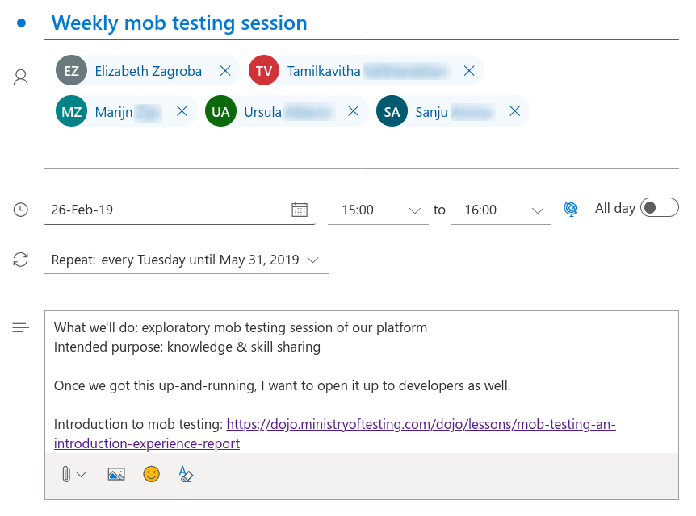
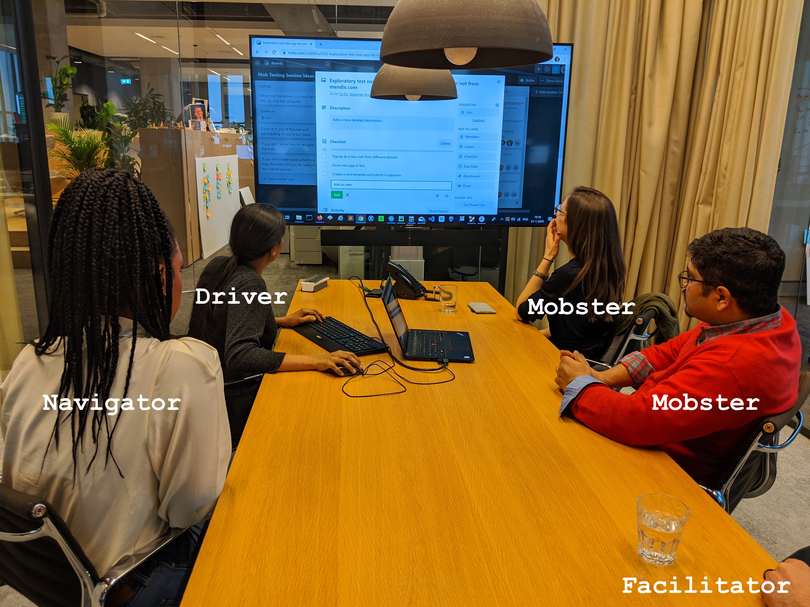
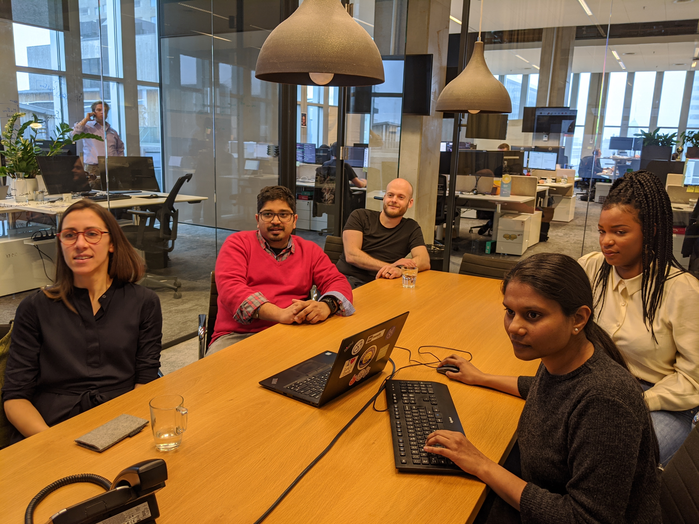
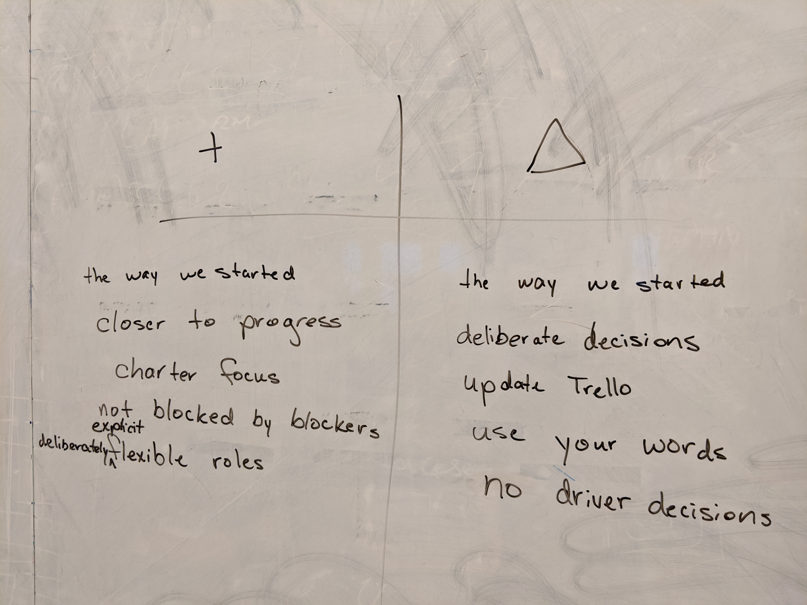

<!-- .slide: class="title-slide" -->

# mob testing: building good habits
#### joep schuurkes & elizabeth zagroba
#### 6 February 2020 European Testing Conference

Notes:
- Elizabeth
- experience report of how mobbing worked for us
- pieces to takeaway and try

===

### agenda
- how we got started
- how we mob
- results
- habits we built (or are still)

Notes: 
- Elizabeth

===

## getting started

Notes:
- Joep

===

### the invite

Notes:
- Joep
- people showed up, except Marijn
- whoever shows up are the right people
- next session was 90 instead of 60 minutes
- mobbing is everyone working on the same computer, turning up the good of pairing

===

### our context

We've had testers on the teams for a long time, but:

- most of these testers were new  to the company
- only a few of them had a lot of  experience

Notes:
- Joep
- new to company
	- limited product knowledge
	- little historical knowledge
	- more difficult to reach out to others
- experience
	- more difficult to fill the gaps

===
<!-- .slide: data-transition="slide-in none" -->

### initial goals

- share knowledge about the products we support
- share testing skills and tools we use
- build a sense of community and collaboration

Notes:
- Joep
- this aligns with Woody's experiences
- start from a shared baseline of knowledge
- lowering the bus/conference factor
- shape a sense of community and collaboration
- work on something together
- build knowledge about the products we support and the tools we use

===
<!-- .slide: data-transition="none" -->
### initial goals

- share knowledge about the products we support
- share testing skills and tools we use
- build a sense of community and collaboration

Notes:
- Elizabeth
- Joep's role/personality enabled this
- prepare for Joep winning the lottery
- arguments on slide were for Elizabeth's teammates
- we did not mob at my previous job

===

## how we mob

Notes:
- Elizabeth

===

### how we mob
- ideas have to be put into words before they can be put into the computer
- communicate at the highest level of abstraction: 
 - intent, what to do, how to do it
- kindness, consideration, and respect

Notes:
- Elizabeth
- intent: add a card for this to the Trello board
- what to do: say something about how we're going to work on Locust today
- how to do it: click on the Add Card at the bottom of the second column. type "Add Locust test for the App Store"
- bias to action/yes, and...

===

### participants & setup

Notes:
- Elizabeth
- rotate mouse and keyboard
- four-minute rotations: reinforces roles & collaboration
- if not working, make duration shorter
- describing roles: facilitator, driver, navigator, mobster
- navigator decides what's next, ask for input
- still mess up driver/navigator
- enabling constraints
- this stuff is hard, stick with it
- the rules are there to create an environment in which something awesome is likely to happen

===

### participants & setup

Notes:
- Elizabeth
- bullying for people who normally show up
- Joep/EZ: more exploratory testing
- Ursula: customer support
- Kavitha: engineer
- Sanju: full of ideas, bias to action
- talkative, collaboration with lots of energy in the room
- all working on the same thing

===

### our Trello board

Notes:
- Elizabeth
- mob chooses and refines together
- diversity of stuff we pick up: testing, refactoring, architecture diagram, etc.
- Selenium, Locust, Pytest, Postman, Python

===

## results
Notes:
- Joep

===

### numbers

- 45 sessions in 11 months <!-- .element: class="fragment" -->
- 12 Mendix products explored (and other stuff!) <!-- .element: class="fragment" -->
- 5(?) bugs found <!-- .element: class="fragment" -->
- 1.6 lines of Python read per minute <!-- .element: class="fragment" -->
- 37 keyboard shortcuts memorized <!-- .element: class="fragment" -->
- 3 operating systems shared <!-- .element: class="fragment" -->
- a million times asked for a different level of abstraction <!-- .element: class="fragment" -->

Notes:
- Joep
- level of abstraction: intent / what / how
- 2 second rule

===

### mobbing happened!

- simultaneous ooh-ing <!-- .element: class="fragment" -->
- expressing intent led to a better action <!-- .element: class="fragment" -->
- when it's not chaos but a mob <!-- .element: class="fragment" -->
- "I'll start using this tomorrow!" <!-- .element: class="fragment" -->
- skeptical but yolo! <!-- .element: class="fragment" -->
- applause for yourself <!-- .element: class="fragment" -->

Notes:
- Joep
- not being strict on the rules, because mobbing was happening (not chaos)
- good energy during the sessions / applause at the end of the session 21 Jan 2020

===

### learning happened!

- keyboard shortcuts & operating systems
- product & domain knowledge
- technical skills

Notes:
- Joep
- technical: testing and programming
- come up with examples

===

<h3 style="color:#23770b">learning >> results</h3>

Notes:
- Joep
- spending 90 minutes where everyone learns is more valuable than 90 minutes of getting stuff done
- very few bugs found, very few notes taken
- very small charter scope
- different from mobbing all the time
- first sessions had really poor testing

===

### retros

	
	

Notes:
- Joep
- should have done from the start
- without retros, plateau after a few sessions
- retro after 40 minutes (because weekly)
- retro to turn up the good (versus focus on things that need to improve)
- warn for rabbit holes
- intent, what to do, how to do it
- also a habit: have a charter specific enough to give direction and a sense of accomplishment

===

## habits

Notes:
- Elizabeth

===

### habits we built

- driver-navigator outside the mob
- reach out to each other for help
- knowing how to troubleshoot your product

Notes:
- Elizabeth
- still no mind-reading :-(
- actively listening to what they mean vs. what they say vs. what you thought they mean
- catching yourself quickly when not acting in line with the habit
- more community feeling and collaborative problem-solving outside of the sessions
- read the error message

===

### habits we're still building

- not making decisions as the driver
- building on each other's ideas
- learn when to move up in abstraction level (intent)
- whoever shows up are the right people
- have a specific-enough charter

Notes:
- Elizabeth
- trying ideas instead of discussing them
- charter: to give direction and a sense of accomplishment
- rarely got priority over release testing
- little to no interest from other people in the unit
- taking notes

===

### want to start mobbing?
- [Mob Testing: An Introduction & Experience Report ](https://dojo.ministryoftesting.com/dojo/lessons/mob-testing-an-introduction-experience-report) Maaret Pyhäjärvi
- [Mob Programming, A Whole Team Approach](https://leanpub.com/mobprogramming) Woody Zuill and Kevin Meadows
- [Mob Programming Guidebook](https://mobprogrammingguidebook.xyz/) Maaret Pyhäjärvi

Notes:
- Elizabeth
- this stuff is hard, stick with it
- have a facilitator just focused on the process
- learning _is_ the productivity, part of the job
- try it, see how it goes

===

## thanks.

Notes:
- Joep and Elizabeth
- find us at the rest of the conference to ask questions and share thoughts.
- invite us to facilitate a session
