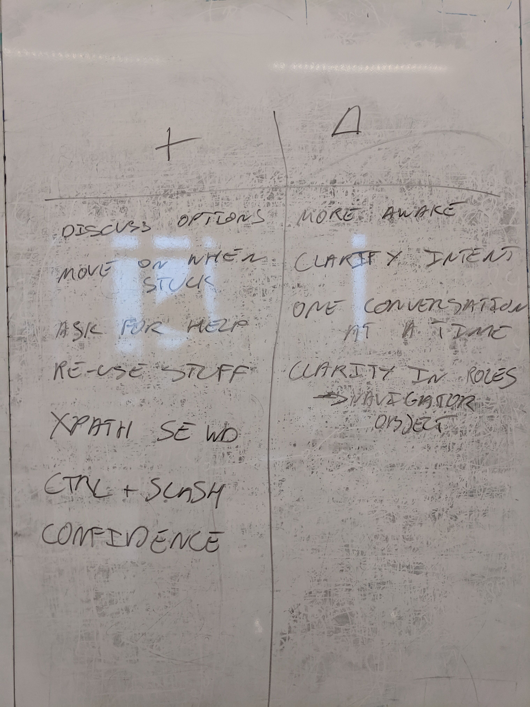

<!-- .slide: class="title-slide" -->

# mob testing: building good habits
#### joep schuurkes & elizabeth zagroba
#### 6 February 2020 European Testing Conference

Notes: 
CONTEXT

===

<!-- .slide: class="section-title" -->
## getting started

===

### the invite

<< @joep: dig up what the outlook invite looked like >>

Notes: 
- people showed up, except Marijn
- whoever shows up are the right people

===

### historical context

Mobbing at Mendix was:

- following a script during a meeting
- demonstration rather than exploration

Notes:
- next step after same people, time, place => computer

===

### initial goals

- more even distribution of testing expertise 
- lowering the bus/conference factor
- start from a shared baseline of knowledge
- shape a sense of community and cooperation
- work on something together
- build knowledge about the products we support and the tools we use

Notes:
- Joep's role/personality enabled this
- arguments on slide were for Elizabeth's teammates 
- knowledge-sharing among participants
- Woody found mobbing as a solution to these issues
@ez maybe an image and fewer words?

===

<!-- .slide: class="section-title" -->
## how we mob

===

### how we mob
- ideas have to be put into words before they can be put into the computer
- communicate at the highest level of abstraction: 
 - intention, location, implementation
- kindness, consideration, and respect

Notes: 
- example of intention, location, implementation
- bias to action/yes, and...

===

### participants & setup

<< Roles/tools in the mob @ez Take picture at a mob session in Jan >>

Notes:
- enabling constraints
- rotate mouse and keyboard
- four-minute rotations
- describing roles: facilitator, driver, navigator, mobster
- still mess up driver/navigator
- this stuff is hard, stick with it
- the rules are there to create an environment in which something awesome is likely to happen

- bullying for people who normally show up

===

### participants & setup

<< Personalities in the mob @ez Take picture at a mob session in Jan >>

Notes:
- describe personalities/skill levels
- Joep, facilitator in our mob
 - amplify but not take away their force
 - call out missed contributions
- actively listening to what they mean vs. what they say

===

### our Trello board

Notes:
- anyone can add, adder brings machine
- mob chooses together which to pick up
- sometimes tickets from the current sprint
- diversity of stuff we pick up: testing, refactoring, architecture diagram, etc.

===

### numbers

- 11 months
- 12 Mendix products explored
- many other things and stuff: Selenium, Locust, Pytest, Postman, Python
- 90-minute sessions every week
- 5(?) bugs found
- about 45 sessions
- 1.6 lines of Python read per minute
- 37 keyboard shortcuts memorized
- 3 operating systems shared
- about a million times asked for a different level of abstraction

Notes:
- @joep Outlook fact-check needed on session and bug numbers

===

### how to know mobbing is happening

- simultaneous ooh-ing
- not intervening as facilitator
- start using it tomorrow

===

<!-- .slide: class="section-title" -->
## lessons we learned

===

### learning > outcomes

- very few bugs found
- very few notes taken
- very small charter scope

Notes: 
- make it as easy as possible to be the best you can be
- generative != productive, how others do tasks
- not being strict on the rules, because mobbing was happening (not chaos)

===

### retros

- without retros, plateau after a few sessions
- positive/reinforcing retros

Notes:
- should have done from the start
- reinforcing retro goes back to:
 - kindness, consideration, and respect
 - bias to action
 - yes, and...

===

### takeaways

- intention, location, implementation
- stuck in a rabbit hole
- have a charter specific enough to give direction and a sense of accomplishment

===

### sessions that didn't lead to learning

- facilitate one session for another team
- have new member join one of our sessions
- yak-shaving setting up someone's machine

Notes:

maybe move stories to other slides if stories are not boring?

===

<!-- .slide: class="section-title" -->
## habits

===

### habits we built

- hold on to strong-style communication outside the mob
 - still no mind-reading
- reach out to each other for help
 - sense of community and cooperation
- troubleshooting around particular topics has improved
 - read the error message

Notes:
- catching yourself quickly when not acting in line with the habit
- good energy during the sessions
- more community feeling and collaborative problem-solving outside of the sessions

===

### habits we're still building

- taking notes ([Dropbox folder](https://www.dropbox.com/home/Mobtesting))
- not making decisions as the driver
- building on each other's ideas
- move our communication to a higher level
 - share more intentions
- whoever shows up are the right people

Notes:
 - trying ideas instead of discussing them
 - rarely got priority over release testing
 - little to no interest from other people in the unit

===
<!-- .slide: class="section-title" -->
## recap

===

### recap 
- whoever are there are the right people
- this stuff is hard, stick with it
- provide a space where learning can happen, and it will
- have a facilitator just focused on the process
- turn up the good in retros during the sessions
- learning _is_ the productivity, part of the job
- enabling people to do it themselves

===

## one piece of advice

don't try this at ~~home~~ work

Notes:
warning: pairing with people who haven't learned this becomes highly frustrating

===

<!-- .slide: class="section-title" -->
## thanks.

find us at the rest of the conference to ask questions and share thoughts.

===

### want to start mobbing?
- invite us to facilitate a session
- [Mob Testing: An Introduction & Experience Report ](https://dojo.ministryoftesting.com/dojo/lessons/mob-testing-an-introduction-experience-report) - Maaret Pyhäjärvi
- [Lessons learned from a year of mobbing](https://www.slideshare.net/maaretp/mob-testing) - Maaret Pyhäjärvi
- [Mob Programming, A Whole Team Approach](https://leanpub.com/mobprogramming) - Woody Zuill and Kevin Meadows
- [Mob Programming Guidebook](https://mobprogrammingguidebook.xyz/) - Maaret Pyhäjärvi
- [GOTO 2017 • Mob Programming: A Whole Team Approach](https://www.youtube.com/watch?v=SHOVVnRB4h0) - Woody Zuill 
