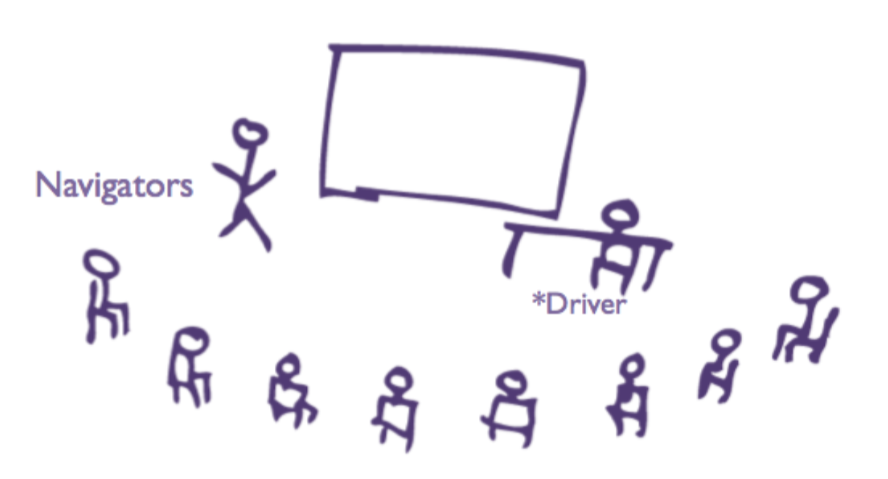
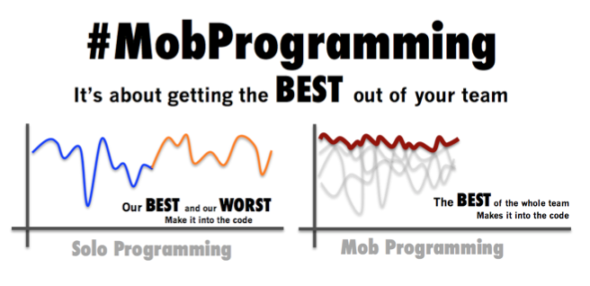

<!-- .slide: class="title-slide" -->

# mob testing: building good habits
#### Joep Schuurkes & Elizabeth Zagroba
#### 6 February 2020 European Testing Conference

===

<!-- .slide: class="section-title" -->
## how we mob

===

### how we mob
- ideas have to be put into words before they can be put into the computer
- communicate at the highest level of abstraction: 
 - intention, location, implementation
- four-minute rotations
- kindness, consideration, and respect
- bias to action
- yes, and...

Notes: @ez too many words on this slide => two slides, or pare it down and just say more?

===

### roles in a mob

<!-- .element: width="85%" -->
 <a href="https://mobprogrammingguidebook.xyz/" class="caption">Used with permission (pending) from the Mob Programming Guidebook by Maaret Pyhäjärvi</a>

Notes: 
- @ez Ask Maaret for permission to use this image
- enabling constraints
- facilitator in our mob
- how tight/loose to stick to roles/rules
- ability to step away

===

### our Trello board

Notes:
- anyone can add, adder brings machine
- mob chooses together which to pick up
- sometimes tickets from the current sprint
- most often weird adjacent non-blocking issues

===

### participants

<< Take picture at a mob session in Jan >>

Notes:
- optional meeting invite, bullying for people who normally show up
- whoever shows up are the right people
- describe personalities/skill levels

===

### initial goals

- more even distribution of testing expertise 
- lowering the bus/conference factor
- start from a shared baseline of knowledge
- shape a sense of community and cooperation
- work on something together
- build knowledge about the products we support and the tools we use

Notes: 
- knowledge-sharing among participants
@ez maybe an image and fewer words?

===

### numbers

- 12 months
- 90-minute sessions every week
- about 45 sessions 
- 3 operating systems shared

Notes:
- @ez Outlook fact-check needed on session and bug numbers, also can't figure out why the bullets are centered just on this slide

===

<!-- .slide: class="section-title" -->
## lessons we learned

===

### simply the best

<!-- .element: width="90%" -->
 <a href="https://mobprogrammingguidebook.xyz/" class="caption">Used with permission (pending) from the Mob Programming Guidebook by Maaret Pyhäjärvi</a>

Notes: 
@ez Ask Maaret for permission to use this image

===

### learning > outcomes

- very few bugs found
- very few notes taken
- very small charter scope

===

### retros

- without retros, plateau after a few sessions
- positive/reinforcing retros

Notes:
- reinforcing retro goes back to:
 - kindness, consideration, and respect
 - bias to action
 - yes, and...

===

### tips (? or some other title)

- have a charter specific enough to decide if you're deviating from it
- stick with it, habits take longer to build
- guarding against rabbit holes

Notes:
- nobody thinks mobbing is useful after just one session

===

<!-- .slide: class="section-title" -->
## habits

===

### habits we built

- hold on to strong-style communication outside the mob
- troubleshooting around particular topics has improved
 - read the error message

Notes:
- catching yourself quickly when not acting in line with the habit

- good energy during the sessions
- more community feeling and collaborative problem-solving outside of the sessions

===

### habits we're still building

- taking notes [Dropbox folder](https://www.dropbox.com/home/Mobtesting)
- not making decisions as the driver
- building on each other's ideas
- move our communication to a higher level
 - share more intentions
- whoever shows up are the right people
 - rarely got priority over release testing
 - little to no interest from other people in the unit

===

### want to start mobbing?
- invite us to facilitate a session
- [Mob Testing: An Introduction & Experience Report ](https://dojo.ministryoftesting.com/dojo/lessons/mob-testing-an-introduction-experience-report) - Maaret Pyhäjärvi
- [Lessons learned from a year of mobbing](https://www.slideshare.net/maaretp/mob-testing) - Maaret Pyhäjärvi
- [Mob Programming, A Whole Team Approach](https://leanpub.com/mobprogramming) - Woody Zuill and Kevin Meadows
- [Mob Programming Guidebook](https://mobprogrammingguidebook.xyz/) - Maaret Pyhäjärvi
- [GOTO 2017 • Mob Programming: A Whole Team Approach](https://www.youtube.com/watch?v=SHOVVnRB4h0) - Woody Zuill 

===

<!-- .slide: class="section-title" -->
## thanks.

find us at the rest of the conference to ask questions and share thoughts.
